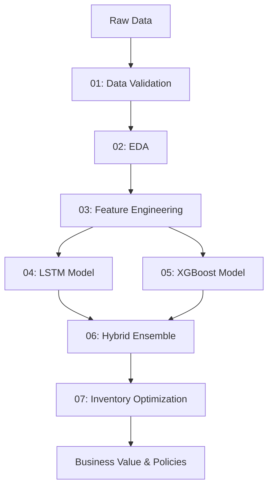

## Supply Chain Forecasting and Optimization

This repository contains a **complete end-to-end Intelligent Supply Chain Optimization System** that combines advanced demand forecasting with inventory optimization. The workflow is implemented as a sequence of Jupyter notebooks covering data validation, exploratory analysis, feature engineering, multi-model forecasting (LSTM, XGBoost, and hybrid ensemble), and actionable inventory policy optimization.

### 🎯 Project Overview

This system delivers:
- **Accurate demand forecasting** with 0.698% MAPE using XGBoost
- **Dynamic inventory optimization** with reorder points and EOQ calculations
- **Cost savings of 15.45%** ($104,446) through optimized inventory policies
- **Comprehensive model comparison** across naive baseline, LSTM, XGBoost, and multiple hybrid strategies
- **Per-SKU performance tracking** and dynamic weight optimization

### 📂 Repository Structure

#### Notebooks (Run in sequence)

- **`01_data_loading_and_validation.ipynb`**: Loads the raw supply chain dataset, performs data cleaning, handles missing values, validates data types and ranges, and saves a cleaned/validated version for downstream analysis.

- **`02_eda.ipynb`**: Exploratory data analysis including univariate and multivariate summaries, time series patterns, seasonality detection, and relationships between operational variables. Outputs: `supply_chain_eda_ready.csv`.

- **`03_feature_engineering.ipynb`**: Engineering of advanced features including time-based lags, rolling statistics, categorical encodings, and domain-specific transformations. Outputs: `features_lstm.csv`, `features_xgboost.csv`, `feature_registry.json`.

- **`04_lstm_model.ipynb`**: Deep learning time-series forecasting using LSTM architecture with sequence modeling for temporal dependencies, trends, and seasonality. Outputs: `lstm_best_model.keras`, `lstm_final_model.keras`, `lstm_test_predictions.csv`, `lstm_metrics.json`, `lstm_sku_performance.csv`.

- **`05_xgboost_model.ipynb`**: Gradient-boosted decision trees with hyperparameter tuning and comprehensive feature importance analysis. Outputs: `xgb_best_params.json`, `xgb_test_predictions.csv`, `xgb_metrics.json`, `xgb_sku_performance.csv`, `xgb_feature_importance.csv`, `xgb_permutation_importance.csv`.

- **`06_hybrid_model.ipynb`**: Ensemble forecasting combining LSTM and XGBoost predictions using multiple strategies (simple average, weighted blending, meta-learner, and dynamic per-SKU weights). Outputs: `hybrid_predictions.csv`, `hybrid_metrics.json`, `all_model_comparison.csv`, `sku_dynamic_weights.csv`.

- **`07_inventory_optimization.ipynb`**: Intelligent inventory policy engine that calculates dynamic reorder points, economic order quantities (EOQ), and safety stock using hybrid forecasts. Performs policy simulation and business value analysis. Outputs: `inventory_policy.csv`, `policy_comparison.csv`, `simulation_results.csv`, `business_value.json`.

#### Data Files

- **`data/`**: Contains raw input data (`supply_chain_dataset1.csv`). This folder is git-ignored.
- **`supply_chain_validated.csv`**: Cleaned and validated dataset from Notebook 01.
- **`supply_chain_eda_ready.csv`**: EDA-processed dataset from Notebook 02.

#### Feature Engineering Outputs

- **`features_lstm.csv`**: LSTM-ready features with sequence formatting.
- **`features_xgboost.csv`**: Tabular features for gradient boosting.
- **`feature_registry.json`**: Complete registry of all engineered features with metadata.

#### Model Artifacts

- **`lstm_best_model.keras`** / **`lstm_final_model.keras`**: Trained LSTM models.
- **`xgb_best_params.json`**: Optimized XGBoost hyperparameters.
- **`lstm_test_predictions.csv`**: LSTM forecasts on test set.
- **`xgb_test_predictions.csv`**: XGBoost forecasts on test set.
- **`hybrid_predictions.csv`**: Ensemble forecasts combining both models.

#### Performance Metrics

- **`lstm_metrics.json`**: LSTM model performance (MAE, RMSE, MAPE, R²).
- **`xgb_metrics.json`**: XGBoost model performance.
- **`hybrid_metrics.json`**: Hybrid model performance with optimal blending weights.
- **`all_model_comparison.csv`**: Side-by-side comparison of all forecasting approaches.
- **`lstm_sku_performance.csv`**: Per-SKU metrics for LSTM.
- **`xgb_sku_performance.csv`**: Per-SKU metrics for XGBoost.
- **`sku_dynamic_weights.csv`**: Optimal LSTM/XGBoost weights per SKU.

#### Feature Analysis

- **`xgb_feature_importance.csv`**: XGBoost gain-based feature importance.
- **`xgb_permutation_importance.csv`**: Permutation-based feature importance.

#### Inventory Optimization Outputs

- **`inventory_policy.csv`**: Calculated reorder points, EOQ, and safety stock per SKU.
- **`policy_comparison.csv`**: Comparison of different inventory strategies.
- **`simulation_results.csv`**: Simulated inventory trajectories and events.
- **`business_value.json`**: Cost savings and business impact summary.

### 📊 Data Source

- **Input data**: The notebooks expect a supply chain dataset (`data/supply_chain_dataset1.csv`) containing historical observations for forecasting.
- **Current dataset**: Synthetic [High-Dimensional Supply Chain Inventory Dataset](https://www.kaggle.com/datasets/ziya07/high-dimensional-supply-chain-inventory-dataset) from Kaggle.
- **Git ignore**: The `data/` directory is excluded from version control. You must provide the data locally before running the notebooks.

### 🚀 Environment Setup

1. **Install Python**
   - Use **Python 3.9+** (3.10 or 3.11 recommended).

2. **Create and activate a virtual environment (recommended)**

   ```powershell
   # Windows PowerShell
   python -m venv .venv
   .venv\Scripts\Activate.ps1
   ```

   ```bash
   # Linux/macOS
   python -m venv .venv
   source .venv/bin/activate
   ```

3. **Install dependencies**

   Install required libraries for the complete workflow:

   ```bash
   pip install pandas numpy scikit-learn matplotlib seaborn xgboost tensorflow jupyter
   ```

   Core dependencies:
   - **Data processing**: pandas, numpy
   - **Visualization**: matplotlib, seaborn
   - **Machine learning**: scikit-learn, xgboost
   - **Deep learning**: tensorflow (includes Keras)
   - **Notebooks**: jupyter, ipykernel

### 📖 Running the Notebooks

1. **Prepare your data**
   - Create a `data/` directory in the project root
   - Place your input dataset as `data/supply_chain_dataset1.csv`

2. **Start Jupyter**

   ```bash
   jupyter lab
   # or
   jupyter notebook
   ```

3. **Execute notebooks in sequence**
   1. `01_data_loading_and_validation.ipynb` — Data preparation
   2. `02_eda.ipynb` — Exploratory analysis
   3. `03_feature_engineering.ipynb` — Feature creation
   4. `04_lstm_model.ipynb` — LSTM training
   5. `05_xgboost_model.ipynb` — XGBoost training
   6. `06_hybrid_model.ipynb` — Ensemble blending
   7. `07_inventory_optimization.ipynb` — Policy optimization

**Important**: Run notebooks sequentially as each depends on outputs from previous steps.

### 🎯 Model Performance Summary

| Model | MAE | RMSE | MAPE (%) | R² |
|-------|-----|------|----------|-----|
| Naive Baseline | 2.433 | 3.037 | 15.04 | 0.694 |
| LSTM | 6.285 | 7.726 | 33.04 | -0.982 |
| **XGBoost** | **0.105** | **0.182** | **0.698** | **0.999** |
| Hybrid Simple Avg | 3.143 | 3.863 | 16.57 | 0.505 |
| Hybrid Weighted | 0.105 | 0.182 | 0.698 | 0.999 |
| Hybrid Meta-Learner | 0.106 | 0.184 | 0.704 | 0.999 |
| Hybrid Dynamic | 0.137 | 0.206 | 0.859 | 0.999 |

**Best Model**: XGBoost (or Hybrid Weighted with 100% XGBoost weight)

### 📈 Modeling Approach

#### LSTM Model (`04_lstm_model.ipynb`)
- **Architecture**: Sequence-based deep learning for time-series forecasting
- **Strengths**: Captures temporal dependencies, trends, and seasonality
- **Outputs**: 
  - `lstm_best_model.keras` / `lstm_final_model.keras`
  - `lstm_test_predictions.csv`
  - `lstm_metrics.json`
  - `lstm_sku_performance.csv`

#### XGBoost Model (`05_xgboost_model.ipynb`)
- **Architecture**: Gradient-boosted decision trees with hyperparameter optimization
- **Strengths**: Exceptional performance on tabular data, interpretable feature importance
- **Outputs**: 
  - `xgb_best_params.json`
  - `xgb_test_predictions.csv`
  - `xgb_metrics.json`
  - `xgb_sku_performance.csv`
  - `xgb_feature_importance.csv`
  - `xgb_permutation_importance.csv`

#### Hybrid Ensemble (`06_hybrid_model.ipynb`)
- **Strategies**: 
  - Simple average of LSTM + XGBoost
  - Weighted blending with optimized weights
  - Meta-learner (LightGBM stacking)
  - Dynamic per-SKU weight optimization
- **Optimal Result**: Weighted blend (100% XGBoost, 0% LSTM)
- **Outputs**: 
  - `hybrid_predictions.csv`
  - `hybrid_metrics.json`
  - `all_model_comparison.csv`
  - `sku_dynamic_weights.csv`

#### Inventory Optimization (`07_inventory_optimization.ipynb`)
- **Methods**: 
  - Dynamic Reorder Point (ROP) calculation
  - Economic Order Quantity (EOQ) optimization
  - Safety stock computation with service level targets
  - Multi-strategy policy simulation
- **Business Impact**:
  - **Cost savings**: $104,446 (15.45% reduction)
  - **Service level**: 95% target maintained
  - **Best strategy**: XGBoost-based forecasting
- **Outputs**: 
  - `inventory_policy.csv`
  - `policy_comparison.csv`
  - `simulation_results.csv`
  - `business_value.json`

### 💼 Business Value

The complete system delivers tangible business benefits:

- **15.45% cost reduction** through optimized inventory policies
- **Sub-1% MAPE** forecasting accuracy enables precise planning
- **Dynamic per-SKU optimization** adapts to product-specific patterns
- **95% service level** maintained while reducing inventory costs
- **Comprehensive model comparison** ensures selection of best approach
- **Actionable inventory policies** with reorder points and order quantities

### 🔧 Key Features

- **Complete end-to-end pipeline**: From raw data to actionable inventory policies
- **Multiple forecasting approaches**: LSTM, XGBoost, and ensemble methods
- **Comprehensive evaluation**: MAE, RMSE, MAPE, R² metrics with per-SKU analysis
- **Feature engineering registry**: Tracked and documented feature transformations
- **Inventory optimization**: Dynamic ROP, EOQ, and safety stock calculations
- **Business value quantification**: Cost savings and operational impact analysis
- **Extensive visualizations**: Time series plots, feature importance, inventory trajectories

### 🔄 Reproducibility & Extensions

#### Reproducibility
- **Random seeds**: Set in notebooks for NumPy, TensorFlow, and XGBoost for consistent results
- **Versioned outputs**: All key artifacts saved with clear naming conventions
- **Sequential execution**: Follow notebook order for reproducible pipeline

#### Potential Extensions
- **Additional models**: Try Prophet, ARIMA, or Transformer architectures
- **Hyperparameter tuning**: Implement Bayesian optimization or AutoML
- **Real-time forecasting**: Deploy models for production inference
- **Multi-horizon forecasting**: Extend to predict multiple periods ahead
- **Advanced optimization**: Add constraints for storage capacity, budget limits
- **Sensitivity analysis**: Test robustness to lead time and demand variability
- **Integration**: Connect to ERP systems or warehouse management platforms

### 📝 Project Workflow



### 📄 License

This project is licensed under the MIT License. See the [LICENSE](LICENSE) file for details.

### 🤝 Contributing

Contributions are welcome! To extend this project:
1. Fork the repository
2. Create a feature branch
3. Make your improvements
4. Submit a pull request with clear documentation

### 📧 Contact

For questions or suggestions, please open an issue in this repository.

---

**Last Updated**: March 2026  
**Status**: Complete end-to-end pipeline with demonstrated business value

